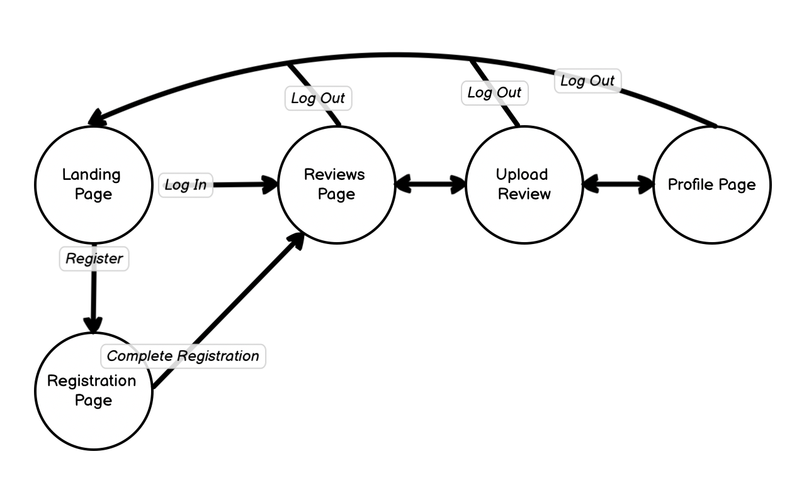
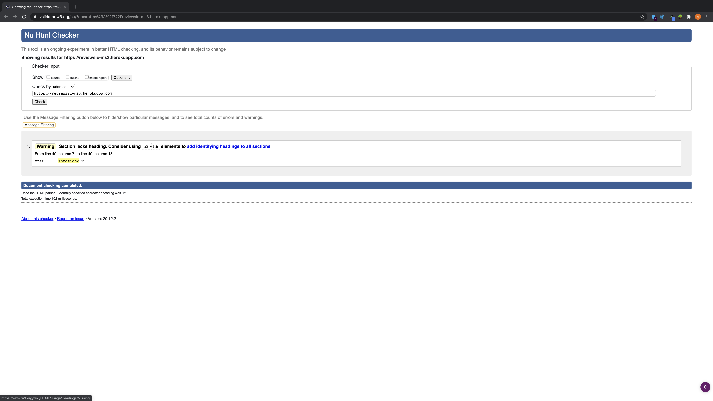
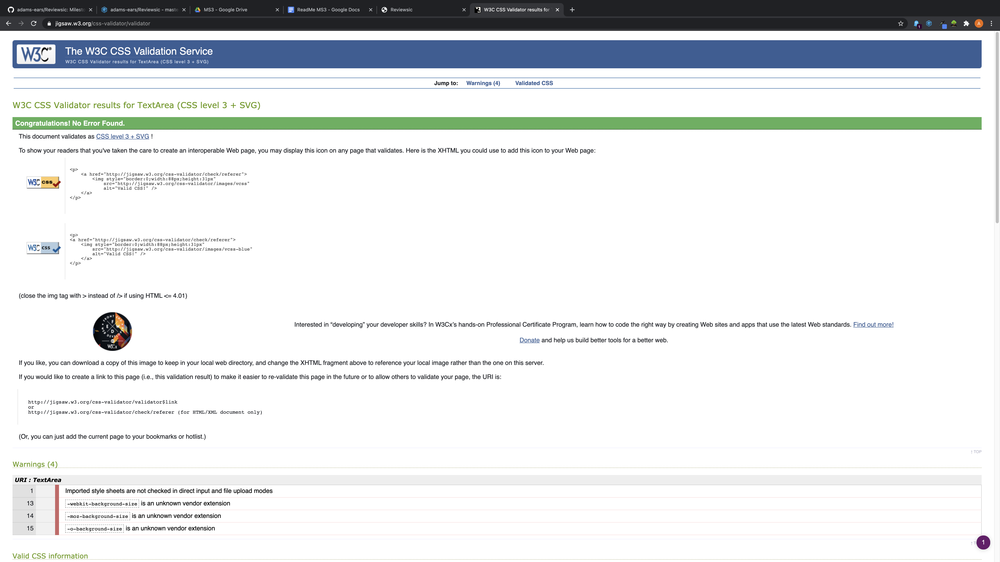
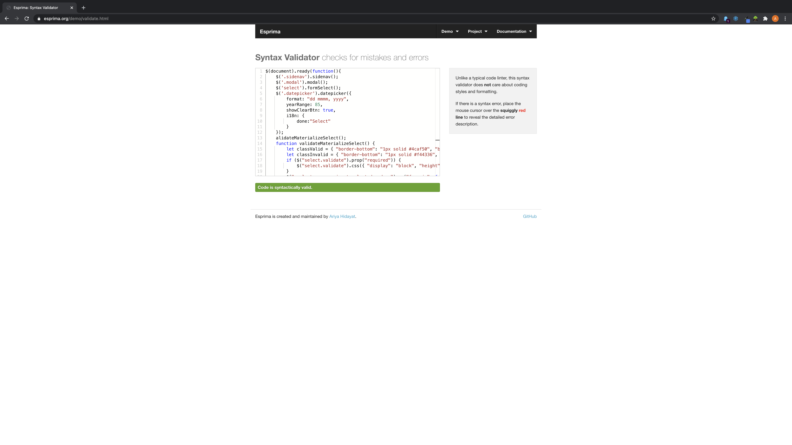
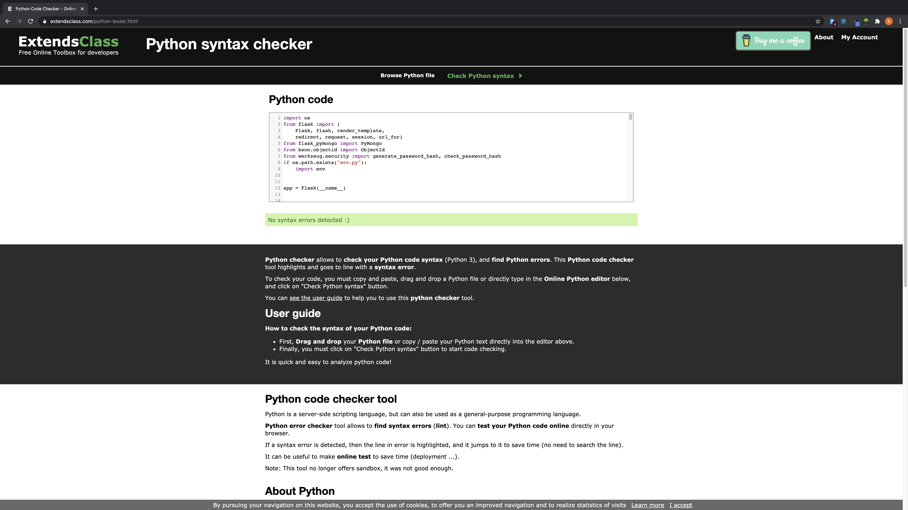

 

# Reviewsic
[Live Site](https://reviewsic-ms3.herokuapp.com/)

This Project has been designed as a web based application in which music reviews can be submitted, edited and updated. 
The **Reviewsic** project will highlight what I have learnt in the course so far using HTML, CSS, Javascript but now with the addition of the 
backend language Python and inclusion of database manipulation through Mongodb.

## Contents 
1. [Project](#project)
2. [UX](#ux)
3. [Features](#features)
4. [Technologies](#tech)
5. [Testing](#test)
6. [Deployment](#deploy)
7. [Credits](#credit)

## Project 
My project will be a reflection of what I've learnt so far on the Full Stack Developer course. Reviewsic is a web based application which allows users to sign up and publish reviews of their favourite gigs, albums, eps and singles. 
Each review published can be found on the users profile, where at any point the owner of the profile can edit, 
update or delete any of the reviews they have posted. Along with the review posting to each individual profile it will also be sent directly to the main page where all users' 
reviews can be found either through scrolling or using the search function.

The site is made up of five individual pages with a consistent design throughout all. The five pages and purpose are as follows:

- **Landing Page:** Initial page that all users will come to it will include a call to action for registration or login (If registration is required link will take you directly to registration page)
- **Registration Page:** Registration form including First Name, Last Name, Username, Email and Password
- **Reviews Page :** Cards showing user submitted reviews, search function to find specific reviews
- **Upload Reviews Page :**  Form including Category, Artist Name, Record/Venue Name, Release/Show Date, Rating, Review and Image Upload
- **Edit Reviews Page :** Same page as upload reviews page with pre filled form which is updatable to the Mongodb database
- **Profile Page :** Profile: Users individual profile page showing own uploads where editing and deleting can occur

## UX 
This site brings the user to sign up and  easily navigate through from landing page to uploading reviews, seeing thier own dedicated profile and reading reviews.  
### User Stories
The users needs:
- The user is able to upload reviews of  album, ep, single or live gig
- The user is able to search for specific reviews from other users
- The user is able to edit and delete own reviews at any point in time
- The user is able to register and have dedicated profile

### Wireframes

The links below will take you to a PDF of each of the wireframes i have created for this project.

[Desktop Wireframe](https://github.com/adams-ears/Reviewsic/blob/master/static/wireframe/Desktop%20Wireframe.pdf)

[Mobile Wireframe](https://github.com/adams-ears/Reviewsic/blob/master/static/wireframe/Mobile%20Wireframe.pdf)

## Features 

Here is a list of the features included on the site. Along with possible additions later in order to develop the site:

**Features included:**
- Individual profile pages with ability to edit and delete previous reviews
- Upload review page with in depth form passing all data to MongoDB
- Reviews on main page in cards which expand with full detail once clicked on
- Responsive design, with all pages working well on desktop, tablet and mobile
- Search function using Artist Names and Album/Venue names to look for reviews.
- Pop out calendar for date selection on upload page

**Future features to be included at a later stage:**
- Positive and negative review voting system in order for users to have opinion on other peoples posts
- Directly shareable reviews from profiles to social media including Facebook and Twitter

**Other Feature Mentions**
Whilst developing the use of an env.py was used to set and manage the environment variables during the programming process. 
Social media links have been included in the development  process but will not be linked currently to any external pages, due to social media not existing currently for this project. 
They have been included into the footer for the live site but are linked currently to a different source.

### Development Modification
During the development process various factors that had been shown in the design of the site through wireframes didn't work as well on the live site. The main modifcation 
is the inclusion of a background across the whole site in order to make the webpage more interesting to look at, by doing this containers were added to forms and the callouts to 
give more definition and calrity to the input fields, colourful buttons were also added as an eye catching adjustment. The choice to not automatically log users in after registration has been considered 
as an extra security measure meaning the user will have to physically log in after registration. Finally not adding the socail media buttons onto the footer was decided as they wouldnt be linked to any external page
but is something that can be added at a later date.

## Technologies 

Various different technologies have been used throughout my project, they are as follows:

- **Balsamiq** Rapid, effective and fun wireframing software.
- **Github** A cloud-based hosting service that lets you manage Git repositories.
- **Git**  A Distributed Version Control tool that is used to store different versions of a file in a remote or local repository.
- **Gitpod** An online IDE, providing a full working development environment.
- **Bootstrap** A front-end framework for developing responsive and mobile-first websites.
- **Markdown** A lightweight markup language with plain-text formatting syntax.
- **HTML5** Another markup language, predominantly used to structure and present content to the world wide web.
- **CSS3** Cascading style sheet language used in conjunction with HTML to create ontent and style.
- **jQuery** is a JavaScript library designed to simplify HTML DOM tree traversal and manipulation
- **Python** Python is an interpreted, high-level and general purpose programming language
- **MongoDB** MongoDB is a general purpose, document-based, distributed database built for modern application developers and for the cloud era.
- **Heroku** Heroku is a platform as a service (PaaS) that enables developers to build, run, and operate applications entirely in the cloud.

## Testing 

### HTML Validatior
All HTML Valid - No Errors Found:

### CSS Validatior
Results from CSS validator - No Errors found.

### Js Validatior
All Syntax Valid

### Python Validatior
All Syntax Valid

### Browser Compatability
Browser compatability was tested across five different web browsers and these are:

- Google Chrome
- Mozilla Firefox
- Internet Explorer 11
- Safari
- Opera

The game was desinged using Google Chrome however functions on all browsers mentioned above. 

### Other testing

## Deployment 
In order to successfully publish the website to **Heroku** use the following steps :
- Head to the [Heroku](heroku.com) website and signup 
- Once Signed up Select **Create New App** from the New dropdown menu
- Fill in **App-name box**  and select **Region**
- Once on homepage select **Connect to Github** in the **Deployment Method**
- Make sure your Github name is showing and search for the repo name in the search box
- Once found click **Connect**
**Your site will now be published at** https://reviewsic-ms3.herokuapp.com/.

-Environment variables can be amended in settings from main page and then select Reveal Config Vars

## Credits 

### Content
All design ideas are original content from the developer
### Reviews
- [Alice In Chains Review](https://www.classicrockreview.com/2012/06/1992-alice-in-chains-dirt/)
- [Pride & Glory Review](https://www.metal-archives.com/reviews/Pride_%26_Glory/Pride_%26_Glory/14825/)
- [Fat Freddy's Drop Review](https://www.theupcoming.co.uk/2016/03/27/fat-freddys-drop-at-the-brixton-academy-live-review/#jp-carousel-248774)
- [Neil Young Review](https://pitchfork.com/reviews/tracks/berwyn-glory/)
- [Haim Review](http://www.thelazywomen.com/bar/a-review-of-wimpiii/)
- [Crostpath](https://www.threesongsandout.com/single-post/crostpaths-mutated-ep-review)
### Media
- [The background image used across the web site](https://pixabay.com/photos/turntable-hub-s-record-players-2157300/)
- [Favicon image](https://www.forbes.com/sites/sap/2019/08/17/can-vinyl-records-also-be-green/) 
- Main Icons from https://fontawesome.com/

### Acknowledgements
I gained inspiration for designing a music review webpage in order to showcase my ability, i would like to thank 
my partner for the constant support and clarity to assist me to develop calmly. I would also like to give 
a large amount of thanks and praise to my mentor Jonathan Munz for once again being supportive of my ideas
My final praise goes to all the tutors, mentors, alumni and current students at Code Institute for being supportive predominantly through
Slack, and email. The community here ate Code Institute is something to be admired especially during 
these tought times! so THANK YOU again!.
